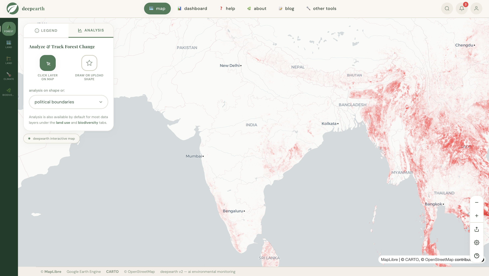
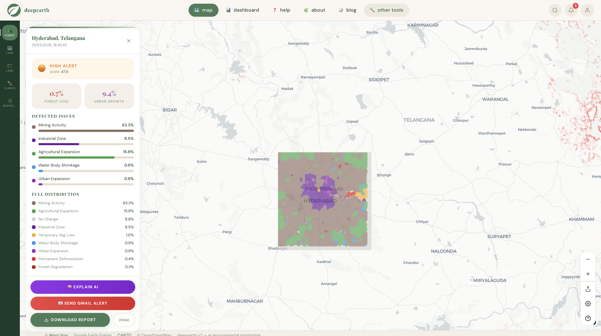
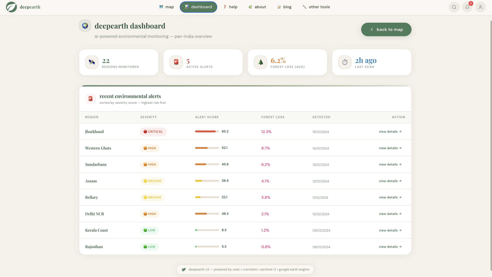

# 🌍 DeepEarth — AI Environmental Monitoring Platform


DeepEarth is an **AI-powered environmental monitoring system** that analyzes satellite imagery to detect ecological changes such as **deforestation, urban expansion, mining activity, and agricultural land expansion**.

The system combines **Deep Learning, Satellite Data, and Explainable AI** to provide **real-time environmental insights, risk alerts, and geospatial visualizations**.

---

# 🌱 Project Demo

## 🌿 Landing Page


---

## 🗺 Interactive Monitoring Map



---

## ⚠ Environmental Risk Analysis



---

## 📊 DeepEarth Dashboard



---

# 🚀 Features

### 🛰 Satellite Environmental Monitoring

* Uses **Sentinel-2 satellite imagery**
* Detects ecological changes across regions
* Powered by **ConvLSTM + U-Net deep learning models**

---

### 🗺 Interactive Geospatial Map

Users can:

• Select regions directly on the map
• Analyze environmental changes
• Visualize AI prediction layers

Built with **MapLibre GL**.

---

### ⚠ Environmental Risk Index

Each region receives a **risk score (0-100)**.

| Score  | Risk Level |
| ------ | ---------- |
| 0-25   | Low        |
| 25-50  | Moderate   |
| 50-75  | High       |
| 75-100 | Critical   |

---

### 📧 Automated Environmental Alerts

If risk level becomes **High or Critical**, the system can automatically send **email alerts**.

Example:

```
🚨 DeepEarth Environmental Alert

Region: Hyderabad, Telangana
Risk Level: HIGH

Detected Issues:
Forest Loss: 7%
Mining Activity: 63%
Urban Expansion: 9%
```

---

### 🧠 Explainable AI (Grad-CAM)

DeepEarth provides **AI explanations** showing **why the model predicted environmental change**.

Heatmaps highlight regions influencing the model decision.

---

### 📄 Automated Environmental Reports

Users can generate **PDF environmental reports** containing:

• risk score
• environmental metrics
• satellite prediction maps
• explanation heatmaps

---

# 🧠 AI Architecture

```
Satellite Imagery (Sentinel-2)
        ↓
Google Earth Engine
        ↓
Spectral Feature Extraction
        ↓
ConvLSTM + U-Net Deep Learning Model
        ↓
Environmental Change Detection
        ↓
Environmental Risk Index
        ↓
Grad-CAM Explainability
        ↓
Interactive Map + Dashboard
```

---

# 🛠 Tech Stack

### Frontend

* React
* TailwindCSS
* MapLibre GL

### Backend

* FastAPI
* Python

### AI & Geospatial

* PyTorch
* ConvLSTM
* U-Net
* Google Earth Engine
* Sentinel-2 Satellite Data

### Additional

* Gmail Alert System
* Grad-CAM Explainability
* PDF Report Generation

---

# 📂 Project Structure

```
deepearth
│
├── backend
│   ├── app.py
│   ├── predict.py
│   ├── explainability.py
│   ├── alert_system.py
│   └── report_generator.py
│
├── frontend
│   ├── components
│   ├── pages
│   └── assets
│
├── models
│   ├── best_unet_final.pth
│   └── best_convlstm_final.pth
│
├── screenshots
│   ├── landing.png
│   ├── map.png
│   ├── analysis.png
│   └── dashboard.png
│
└── README.md
```

---

# ⚙️ Installation

### Clone Repository

```
git clone https://github.com/mahitha-chippa4/deepearth.git
cd deepearth
```

---

## Backend Setup

Create environment:

```
python -m venv venv
```

Activate:

```
source venv/bin/activate
```

Install dependencies:

```
pip install -r requirements.txt
```

Run backend:

```
uvicorn backend.app:app --reload
```

Backend runs at:

```
http://localhost:8000
```

---

## Frontend Setup

```
cd frontend
npm install
npm run dev
```

Frontend runs at:

```
http://localhost:5173
```

---

# 📧 Email Alert Setup

Create `.env` file:

```
GMAIL_ADDRESS=your_email@gmail.com
GMAIL_APP_PASSWORD=your_app_password
```

---

# 🌍 Future Improvements

* Real-time satellite monitoring
* Global environmental alert network
* Climate change prediction models
* Mobile monitoring application

---

# 👩‍💻 Author

**Mahitha Chippa**


---

⭐ If you like this project, consider **starring the repository!**
